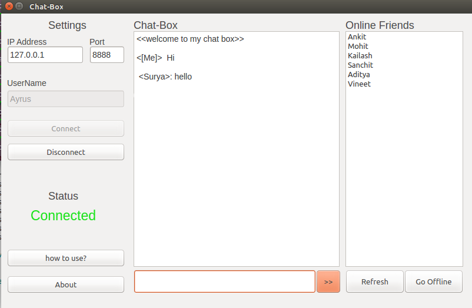

# Chat Aplication using Python QtNetwork
#Developed By : AnTeater515

Basic chat application based on TCP Sockets. I have implementated this using QtNetwork module.

####Approach:
1. chat-server.py needed to execute on the terminal
2. chat.py needed to exetute on client PC.
3. enter the hostname/ IP address on client PC. Server will establish a connection between sever and client through a socket.
4. now send text from client to server and vise versa. 

### How to run this application
#### Dependancies:
1. Python
2. PyQt4(for GUI)

####  Procedure:
1. Run "chat.py" using this command "python chat.py"
2. Create Server using this command "python chat-server.py"
3. Invite other user :)

## Screenshots

